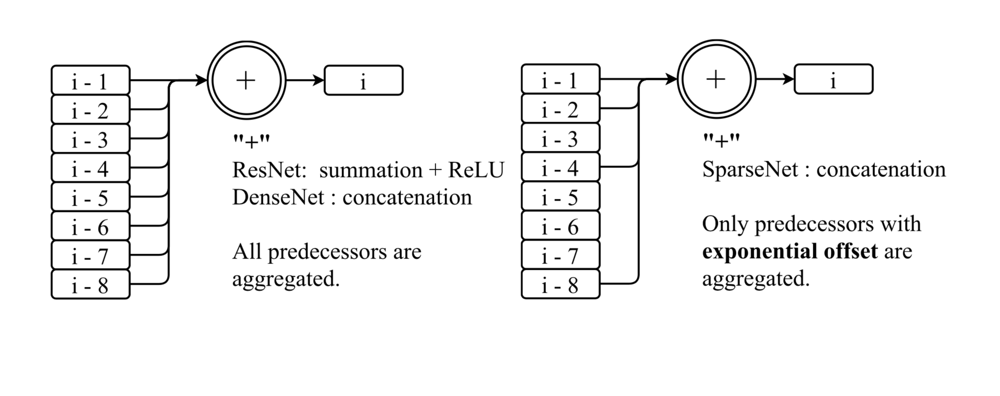

# SparseNet
Sparsely Aggregated Convolutional Networks

[Ligeng Zhu](https://lzhu.me), [Ruizhi Deng](http://www.sfu.ca/~ruizhid/), [Zhiwei Deng](http://www.sfu.ca/~zhiweid/), [Greg Mori](http://www.cs.sfu.ca/~mori/), [Ping Tan](https://www.cs.sfu.ca/~pingtan/)

# What is SparseNet?
SparseNet is a new baseline architecture similar to DenseNet. The key difference is, SparseNet only aggregates previous layers with exponential offset, for example, i - 1, i - 2, i - 4, i - 8, i - 16 ...

# Why to use SparseNet?
# Better Performance

<table>
<tr><th>Table 1 Heading 1 </th><th>Table 1 Heading 2</th></tr>
<tr><td>

Architecture | Params | CIFAR 100
--- | --- | ---
DenseNet-40-12  | 1.1M | 24.79
DenseNet-100-12 | 7.2M | 20.97
DenseNet-100-24 | 28.28M | 19.61
--- | --- | ---
SparseNet-40-24  | 0.76M | 24.65
SparseNet-100-36 | 5.65M | 20.50
SparseNet-100-{16,32,64} | 7.22M | 19.49

</td><td>

Architecture | Params | CIFAR 100
--- | --- | ---
DenseNet-40-12  | 1.1M | 24.79
DenseNet-100-12 | 7.2M | 20.97
DenseNet-100-24 | 28.28M | 19.61
--- | --- | ---
SparseNet-40-24  | 0.76M | 24.65
SparseNet-100-36 | 5.65M | 20.50
SparseNet-100-{16,32,64} | 7.22M | 19.49

</td></tr> </table>

## Efficient Parameter Utilization

# Pretrained model
On the way.
